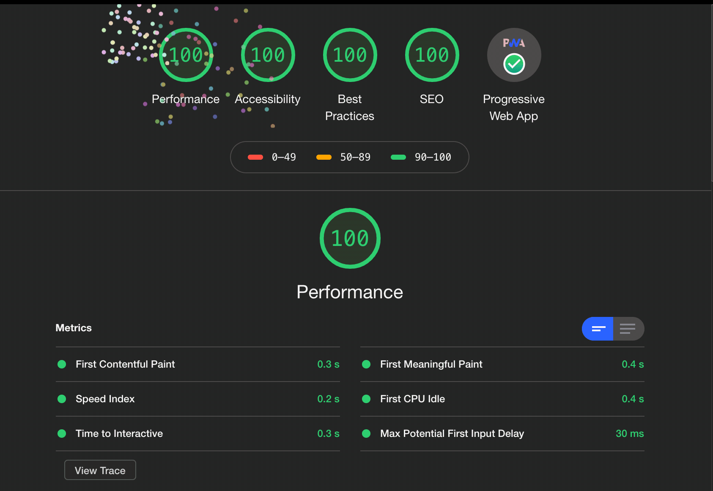
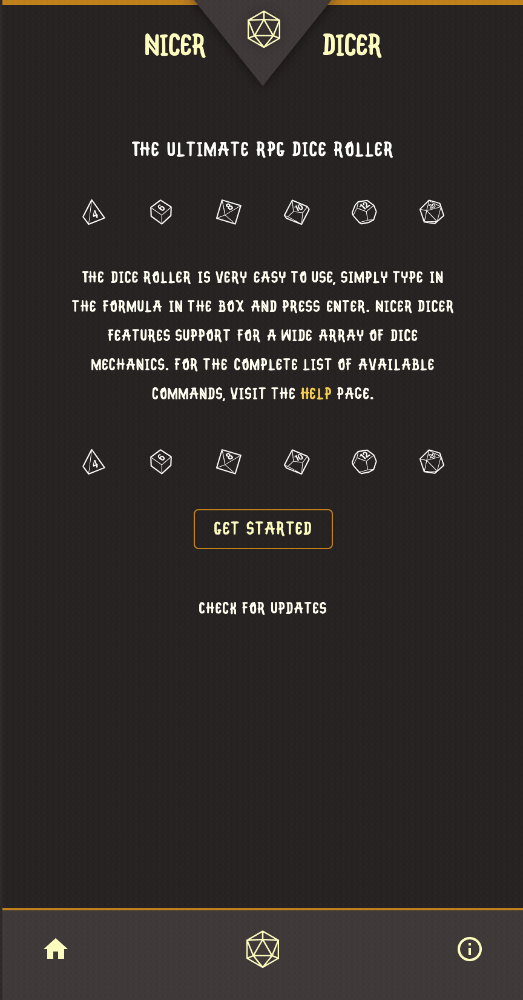

   

# [Nicer Dicer](https://nicer-dicer.netlify.com/) - The Ultimate RPG Dice Roller

An online RPG Dice Roller available online [here](https://nicer-dicer.netlify.com/).

Meant to handle just about any possible dice roll you can think of. Nicer Dicer follows the [Roll20 Dice Reference](https://wiki.roll20.net/Dice_Reference) and syntax. 

## Project

This is an open source, mobile-first dice roller project built using [React](https://reactjs.org/) and [Typescript](https://www.typescriptlang.org/index.html).
This repository contains the frontend UI as well as a vendored version of the dice engine: [`dice-typescript`](https://github.com/kimrejstrom/dice-typescript) (see link for details).

It is a fully fledged Progressive Web App (PWA) bootstrapped using the [`rr-starter-kit`](https://github.com/kimrejstrom/rr-starter-kit) (see link for details), and can thus be added to your phone's homescreen as a fully functioning offline app.

## Screenshots

## Authors

 [**Kim Rejström**](https://github.com/kimrejstrom)

## License

This project is licensed under the `MIT` License - see the [LICENSE](LICENSE) file for details
